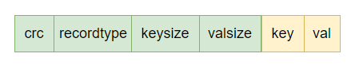
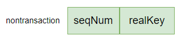
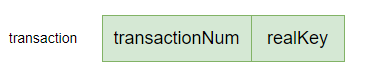

# DB initialization

1. 如果不存在指定目录，则创建根目录并上锁（只能一个 DB 实例使用）
2. 加载 merge 目录
3. 加载数据目录下数据文件，更新 DB 的活跃文件句柄和已写满旧文件句柄
4. 从 hint 文件中读取索引
5. 从 3. 得到的文件句柄中更新索引

# Put

1. append 方式写入磁盘
2. 将写的结果的 record 的位置信息写入索引

# Get

1. 从给定的 key 查找索引得到 key value 的位置信息
2. 读取文件

# Delete

1. 查找索引，不存在直接返回
2. append 方式写入磁盘
3. 删除索引

# Close

1. 关闭索引
2. 关闭活跃文件
3. 保存当前事务序列号到事务序列号文件
4. 关闭旧数据文件

# Stat

# Backup

1. 创建指定的目标目录
2. 复制所有文件到目标目录

# Merge

1. 无效数据占数据文件大小的比例没有超过给定阈值就返回（比如，全部都是有效数据）
2. 剩余磁盘空间不够容纳 merge 后的数据就返回
3. 正式 merge
  1. 持久化当前活跃文件并建立新的活跃文件
  2. 删除旧的 merge 目录建立新的 merge 目录，并在新的 merge 目录下打开一个 DB 实例
  3. 在新的 merge 目录下建立 hint file 存储索引
  4. 遍历旧的目录下的数据文件，对每个 record 判断它是不是有效的（和内存里的索引比较），如果是，那么用新的 merge DB 实例写到 merge 目录下（会创建新的活跃文件），并将对应 record 返回的索引信息写入 hint file
  5. 持久化 hint file 和 merge 目录下的数据文件，merge 目录下创建一个 merge 完成标识文件，其中写入旧目录中最大的那个被 merge 的文件的文件 ID

这样就创建了一个 merge 目录，其中包含 merge 完成的数据文件和一个最大被 merge 文件的文件 ID，在下一次打开原始数据文件目录时（构建 DB 实例），就会首先访问这个 merge 目录。

## logMergeFiles

如果读取到了 mergefinishedfile 就标识 merge 完成了，然后读取到最大被 merge 的 file ID，删除数据目录下的 file ID 小于这个读到的 ID 的数据文件（这些文件确定是已经被 merge 了），将 merge 目录下 merge 完成的数据文件拷贝到当前数据目录下

# key 

record format

for non transaction record key format, seqNum is always 0

transaction record key format

# file type

格式|含义
-|-
.data|数据文件
hint-index|索引文件
merge-finished|merge 完成标识以及被 merge 的最新 file ID
seq-num|最新事务序列号
